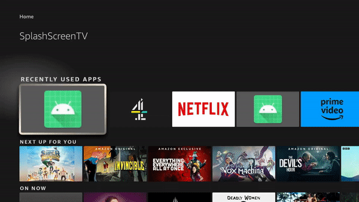

# Splash Screen sample app for Fire TV

This project is an Android TV app showcasing how to develop a Splash Screen for Fire TV apps.

As Fire TV devices are running Fire OS (based on Android 11 or lower) currently you cannot use the
Android 12 new SplashScreen APIs as described in [https://developer.android.com/develop/ui/views/launch/splash-screen](https://developer.android.com/develop/ui/views/launch/splash-screen).

You can follow this guide and check this repository to develop your custom splash screen

## 💻 Building the Splash Screen TV demo

1. Clone the following repository:

`git clone git@github.com:giolaq/splash-screen-fire-tv-demo.git`

2. Connect your Fire TV device following these [instructions](https://developer.amazon.com/docs/fire-tv/connecting-adb-to-device.html)

```
   adb connect 127.0.0.1:58526
```
3. Run the app


## How to develop a custom splash screen for your Fire TV Apps

**Step 1:** Create your custom splash screen

Create a file splashscreen.xml in the drawable directory. This fill will contain all the graphic elements, arranged in layers, of your splash screen.

```xml
<?xml version="1.0" encoding="utf-8"?>
<layer-list xmlns:android="http://schemas.android.com/apk/res/android" android:opacity="opaque">
    <item>
        <shape android:shape="rectangle">
            <solid android:color="@android:color/white"/>
        </shape>
    </item>

    <item>
        <bitmap android:src="@drawable/app_icon_your_company" android:gravity="center"/>
    </item>
</layer-list>
```

Note: SVG (Scalable Vector Graphics) image format performs better compared to other formats in our testing on FireTV devices.

**Step 2:** Create the splash screen theme

In the file styles.xml of your project, define a new style. Then add an item ```android:windowBackground``` set as the splash screen drawable you created the step before.

 ```xml
    <style name="SplashScreenTheme" parent="Theme.SplashScreenTV.NoActionBar">
        <item name="android:windowBackground">@drawable/splashscreen</item>
    </style>
```

**Step 3:** Create the splash screen activity

Create a new activity responsible just to display the splash screen, launch the main activity and terminate.

```kotlin
class SplashScreenActivity : AppCompatActivity() {

    override fun onCreate(savedInstanceState: Bundle?) {
        super.onCreate(savedInstanceState)

        startActivity(Intent(this, MainActivity::class.java))
        finish()
    }
}
```
**Step 4:** Apply the splash screen theme to the splash screen activity

In the AndroidManifest.xml set the theme attribute of the Splash screen activity to the splash screen
theme you created at step 2. Also remember to move the intent filter with the action main and category launcher from the Main Activity to the splash screen activity, as this will be the one launched the first time the user start your app.

```xml
<activity
    android:name=".SplashScreenActivity"
    android:exported="true"
    android:label="@string/title_activity_splash_screen"
    android:theme="@style/SplashScreenTheme">
    <intent-filter>
        <action android:name="android.intent.action.MAIN" />

        <category android:name="android.intent.category.LEANBACK_LAUNCHER" />
    </intent-filter>
</activity>
```

## Done!



## Get support

If you found a bug or want to suggest a new [feature/use case/sample], please [file an issue](../../issues).

If you have questions, comments, or need help with code, we're here to help:
- on Twitter at [@AmazonAppDev](https://twitter.com/AmazonAppDev)
- on Stack Overflow at the [amazon-appstore](https://stackoverflow.com/questions/tagged/amazon-appstore) tag

Sign up to [stay updated with the developer newsletter](https://m.amazonappservices.com/subscribe-newsletter).

## Authors

- [@giolaq](https://twitter.com/giolaq)
